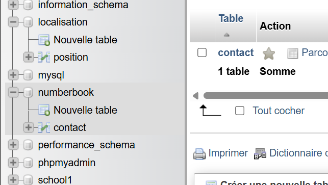
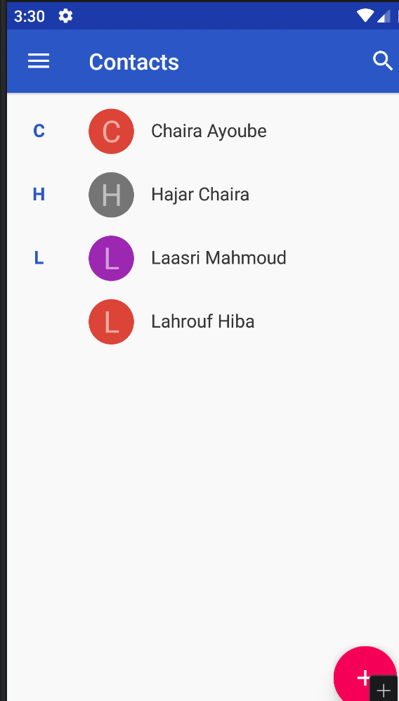
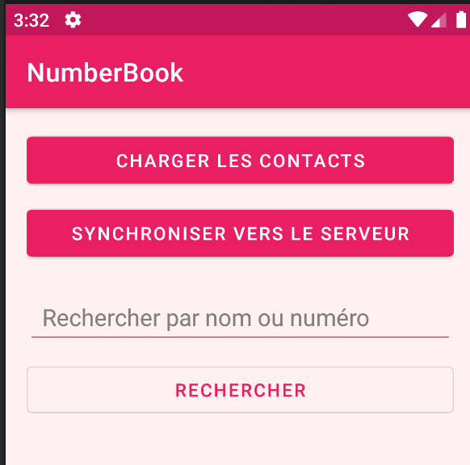
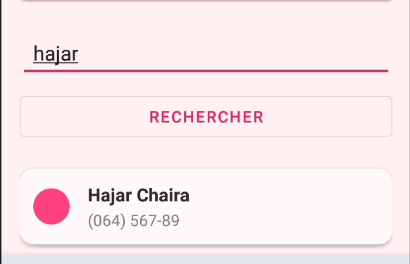
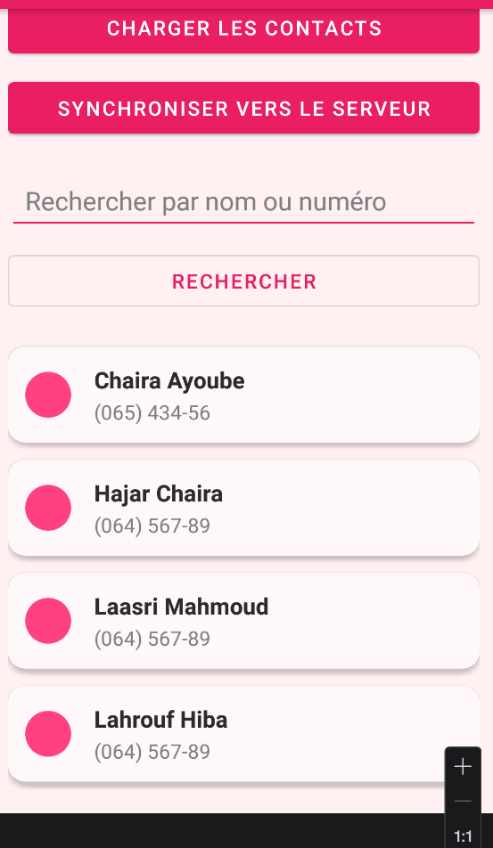
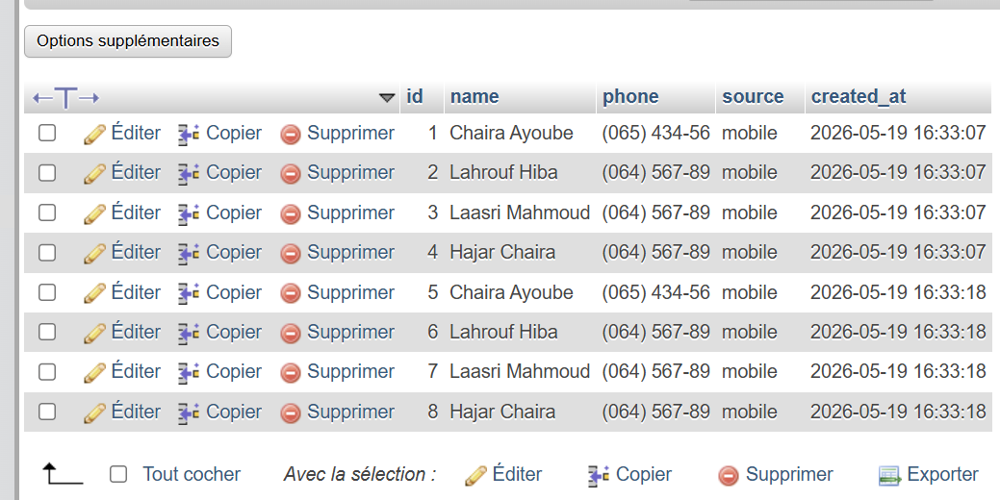

# LAB 20 - Integration des Contacts et Synchro Réseau avec Retrofit
**Cours :** Programmation Mobile : Android avec Java  
**Etudiant :** Hajar Chaira

---

## 1. Objectif pedagogique
Ce laboratoire vise a concevoir et a implementer une solution complete d'interaction systeme et de communication client-serveur. L'application mobile lit les contacts locaux du systeme d'exploitation Android, les met en forme dans un RecyclerView personnalise, puis effectue une synchronisation reseau en convertissant les objets en requetes JSON via Retrofit pour les enregistrer physiquement dans une base de donnees distante MySQL. Une fonctionnalite de recherche en ligne permet ensuite d'interroger cette base distante et de mettre a jour dynamiquement la liste d'affichage.

---

## 2. Apercu visuel de l'interface et Preuves de validation

### Etape par etape du scenario de test

| 1. Structure de la base de données sous phpMyAdmin | 2.  Contacts enregistrés sur l'appareil Android | 3. Interface graphique initiale de l'application |
| :---: | :---: | :---: |
|  |  |  |
| : l'interface d'administration phpMyAdmin montre la création et la présence physique de la base de données numberbook et de sa table contact, prêtes à recevoir les données synchronisées. |  montre la liste des contacts enregistrés localement dans l'application native "Contacts" de l'émulateur  | montrant les boutons d'action et le champ de saisie avant le chargement des données.T |

| 4. Filtrage et Recherche | 5. Affichage complet des contacts chargés | 6. Preuve SQL (phpMyAdmin) |
| :---: | :---: | :---: |
|  |  |  |
| Liste mise a jour dynamiquement apres requête GET de recherche | montre l'application NumberBook après avoir chargé et affiché l'ensemble des fiches contacts de l'appareil. Les contacts sont disposés dans des cartes rose pastel avec des badges circulaires pour chaque initiale. | Insertion physique reussie dans la table MySQL distante |

---

## 3. Demonstration Video

[<video src="img-lab20-dev/video.mp4" controls="controls" style="max-width: 100%;">
</video>](https://github.com/user-attachments/assets/ddd05862-dfa1-4d39-932e-a5fbdba5f8de)

---

## 4. Architecture et Realisation minimale

### Etape 1 : Base de donnees (MySQL & PHP)
Configuration de la base de donnees relationnelle MySQL nommee `numberbook` contenant la table `contact`. Ecriture d'un backend orienté services en PHP comprenant la gestion de connexion PDO, le service d'acces aux donnees, et les points d'entree de l'API REST retournant du JSON (`insertContact.php`, `getAllContacts.php`, `searchContact.php`).

### Etape 2 : Securite du Manifest et Gradle
Declaration des autorisations d'acces `READ_CONTACTS` et `INTERNET` dans le fichier Manifest. Integration de l'attribut `android:usesCleartextTraffic="true"` pour autoriser la communication reseau HTTP non chiffree avec le serveur de test local. Configuration des dependances Retrofit, GSON converter et CardView dans le fichier de construction Gradle.

### Etape 3 : Modele et Client de Reseau (Java)
Creation des modeles structures `Contact` et `ApiResponse` pour la deserialisation automatique. Definition des requetes GET et POST dans l'interface reseau `ContactApi`. Mise en oeuvre d'une instance unique centralisee `RetrofitClient` pointant vers la passerelle de test de l'emulateur.

### Etape 4 : Presentation Graphique Personnalisee (XML)
Developpement d'une charte graphique premium sur le theme rose pastel. Conception d'une interface robuste avec `NestedScrollView` pour eviter toute perte d'affichage ou blocage de defilement lors de la rotation de l'ecran. Design de cellules elegantes sous forme de cartes roses avec un indicateur circulaire pour l'affichage unitaire.

### Etape 5 : Logique et Liaison UI (MainActivity)
Programmation du controle de flux dans `MainActivity` : verification dynamique de la permission utilisateur via le lanceur d'activite moderne, interrogation de l'API de contact systeme via le ContentResolver pour peupler la liste locale, boucle d'envoi asynchrone des fiches contacts en arriere-plan avec Retrofit sans bloquer l'UI Thread, et requete HTTP de recherche distante avec rafraichissement immediat de l'adaptateur de liste.

---

